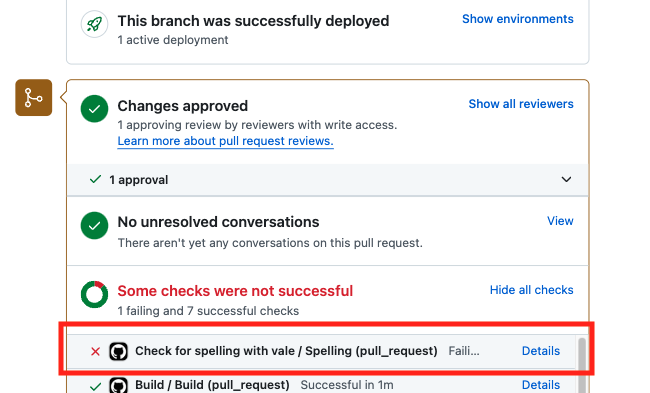
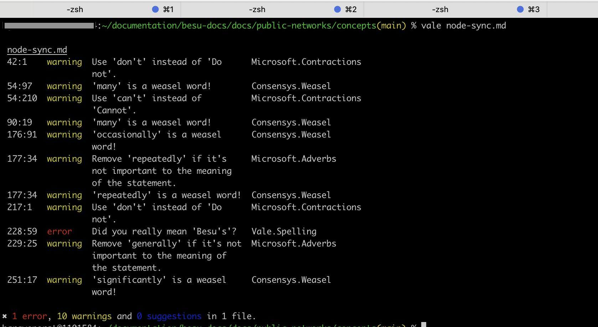
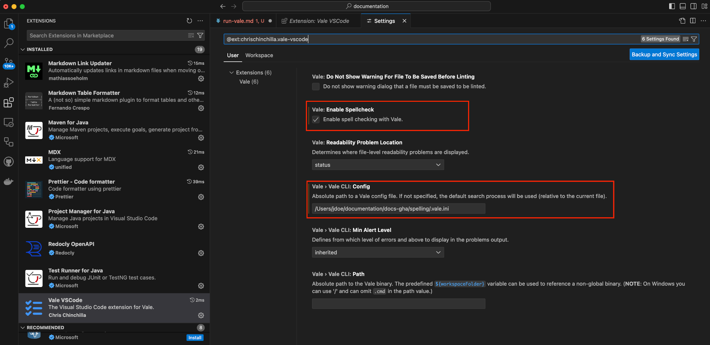

# Run the spelling and style linter

The documentation suite uses [Vale](https://vale.sh/) as the style guide and spelling linter.
Vale is currently integrated into the continuous integration (CI) pipeline and is executed on each
pull request (PR) using a GitHub action. You can select the **Details** link to view the failures.

:::info important
The Vale GitHub workflow runs on all Markdown files (and for some repos YAML files) in the repository, not
only the ones you've updated. However, only items related to files in your PR receive alerts.
Failures in the workflow won't prevent your PR from being merged.

You can run Vale locally to view issues directly related to your PR.
:::

<p align = "center">

</p>

## Run locally

Run Vale locally to view issues related to the Markdown files you're working on. You can run Vale using the
command line, or you can integrate it into a [supported editor](https://vale.sh/docs/integrations/guide/) to
view issues in real-time.

### Use the command line

1. [Install Vale locally](https://vale.sh/docs/vale-cli/installation/#package-managers).

1. Clone the repo containing our Vale settings:

   ```bash
   git clone https://github.com/Consensys/docs-gha.git
   ```

1. Override the default location of the `.vale.ini` file by setting the `VALE_CONFIG_PATH` environment
    variable to the location of the file in the repo. For example, on macOS this is:

    ```bash
    export VALE_CONFIG_PATH="/Users/{user-name}/documentation/docs-gha/spelling/.vale.ini"
    ```

     :::note
     To persist the `VALE_CONFIG_PATH` environment variable across sessions, you’ll need to add the above command to the
     appropriate shell configuration file. For example, on macOS, add it to ~/.zshrc (the default shell configuration
     file in recent versions of macOS).
     :::

1. Run the `vale` command in your terminal with the location of your file. For example:

    ```bash
    vale node-sync.md
    ```

    

    :::note
    If you pass a file that does not exist, Vale will not alert you that the file cannot be found.
    You'll receive a message similar to `0 errors, 0 warnings and 0 suggestions` in the terminal.
    :::

### Use the VS Code integration

You must have the [Visual Studio (VS) Code](https://code.visualstudio.com) editor installed to use this integration.

1. [Install Vale locally](https://vale.sh/docs/vale-cli/installation/#package-managers).

1. Clone the repo containing our Vale settings:

   ```bash
   git clone https://github.com/Consensys/docs-gha.git
   ```

1. [Install the VS Code extension](https://marketplace.visualstudio.com/items?itemName=ChrisChinchilla.vale-vscode)

1. In the settings for the Vale VS Code extension, set the location of the `.vale.ini` file, and
    enable the spell check. The `.vale.ini` file is located within the `spelling` directory in the
    `docs-gha` repo that you cloned onto your local.

    

1. Restart VS Code.

## Contribute to the spell checker

You can contribute to the spell checker by submitting a PR to the [`docs-gha` repository](https://github.com/Consensys/docs-gha).

Learn more about how to [configure Vale](https://github.com/Consensys/docs-gha/tree/main/spelling#configure-vale).
